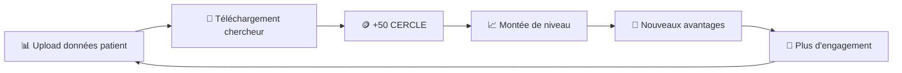
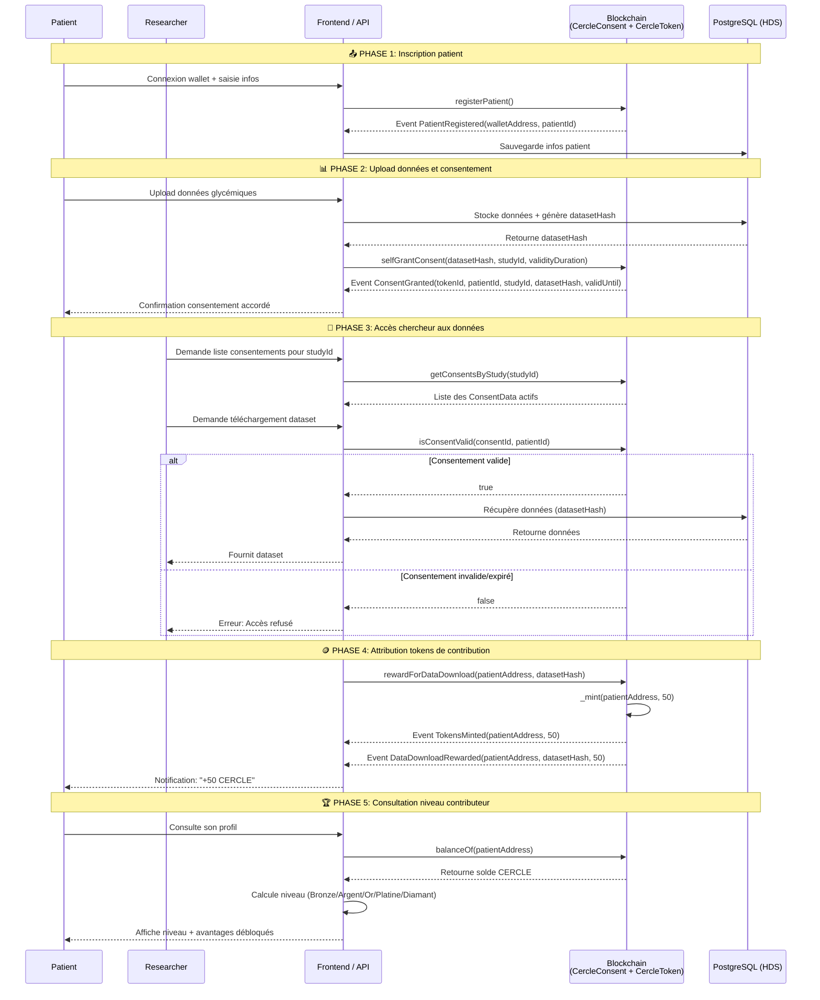

# Cercle Bleu

## Table des matières

* [Présentation](#présentation)
* [Guide utilisateur](#guide-utilisateur)
* [Plan d'apprentissage technique](docs/learning-react.md)
* [Installation et développement](#installation-et-développement)
* [Roadmap](#roadmap-et-améliorations-futures)
* [Sécurité](#sécurité-et-mécanismes-anti-abus)
* [Consentement de partage de donnée](#consentement-de-partage-de-donnée)
* [Système de contribution CercleToken](#système-de-contribution-cercletoken)
* [Diagramme de séquence](#diagramme-de-séquence)
* [Cible marketing](docs/marketing.md)
* [Conformité réglementaire](docs/conformite-reglementaire.md)
* [Refonte éthique](docs/refonte-ethique.md)

## Présentation

Cercle Bleu, plateforme blockchain souveraine dédiée au diabète, gère les consentements et le partage sécurisé des données, via les médecins, pour les chercheurs. Les patients gardent le contrôle et accumulent des points de contribution (CERCLE) qui débloquent des avantages non-monétaires selon leur niveau d'engagement (Bronze, Argent, Or, Platine, Diamant). La communauté patients‑médecins‑chercheurs s'anime autour de forums et rencontres, un programme éducatif propose articles, vidéos et ateliers.

Le contrat [CercleConsent](backend/contracts/CercleConsent.sol) est un contrat de gestion de consentements médicaux basé sur les NFTs (ERC721) en mixant le concept de Soul Bound Token (token ayant un unique propriétaire, sans possibilité de transfert). Il permet au patient d'accorder et de révoquer leur consentement pour l'utilisation de leurs données médicales dans des études spécifiques.

Le contrat [CercleToken](backend/contracts/CercleToken.sol) est un contrat de création de tokens de contribution basé sur l'ERC20, il implémente aussi le concept de SBT (Soul Bound Tokens). Ces tokens de contribution sont appelés `CERCLE` et n'ont aucune valeur monétaire. Un montant de 50 CERCLE est créé sur le compte du patient pour chaque téléchargement de ses données par les chercheurs. Ils servent de mesure au taux d'engagement et permettent d'atteindre des niveaux de contribution (Bronze, Argent, Or, Platine, Diamant) qui débloquent des avantages non-monétaires.

## Guide utilisateur

Cercle Bleu ne nécessite **ni MetaMask, ni wallet, ni frais de transaction**. Un simple email suffit pour commencer.

### Étape 1 : Se connecter

1. Rendez-vous sur [https://mon-cercle-sante.vercel.app](https://mon-cercle-sante.vercel.app)
2. Cliquez sur **"Se connecter"**
3. Entrez votre adresse email et validez le code reçu par mail
4. Un portefeuille blockchain est créé automatiquement en arrière-plan — vous n'avez rien à faire

### Étape 2 : Choisir votre rôle

* **Patient** : gérez vos données de santé et vos consentements de partage
* **Chercheur** : accédez aux données anonymisées des patients ayant consenti

### Étape 3 : Compléter votre profil

Remplissez le formulaire d'inscription correspondant à votre rôle. Les interactions avec la blockchain sont gérées automatiquement, sans frais ni configuration technique.

## Installation et développement

Pour installer et configurer l'environnement de développement, consultez la [documentation](docs/dev.md).

## Roadmap et améliorations futures

### Phase 1 - MVP

* ✅ Smart contracts Consentement et CercleToken
* ✅ API backend et base de données
* ✅ Interface utilisateur
* ✅ Système de badges (Bronze, Argent, Or)
* ✅ Niveaux de contributeur avec avantages progressifs

### Phase 2 - Accessibilité & Onboarding simplifié

* ✅ **Account Abstraction (ERC-4337)** : Login email/Google via Privy, wallet embedded créé automatiquement
* ✅ **Suppression de la dépendance MetaMask** : Wallet embarqué, aucune extension requise
* ✅ **Onboarding simplifié** : Connexion en 3 clics, sans seed phrase ni frais de gas
* 🔑 **Gas Sponsorship (Pimlico/ZeroDev)** : Transactions entièrement gratuites pour les patients (UserOperations ERC-4337)
* 📱 Progressive Web App (PWA) pour accès mobile
* 🔔 Système de notifications (email, push) : expiration consentement, nouvelles études, rewards CERCLE

### Phase 3 - Sécurité & Audit

* 🔐 **Audit smart contracts** par un tiers reconnu (Certik, OpenZeppelin, Trail of Bits)
* 🔐 **Penetration testing** API et frontend
* 🔐 Modification redemptionCode avec bytes32/keccak256
* 🔐 Ajout [ChainLink VRF](https://docs.chain.link/vrf) pour génération code réduction patient
* 🔐 Refactoring système d'autorisation avec dashboard admin
* 🔐 Sécurisation des routes en fonction des rôles
* 📋 **Certification HDS** : audit et documentation de conformité
* 📋 **Conformité RGPD complète** : export de données patient (Article 20), registre des traitements

### Phase 4 - Rôles & Fonctionnalités métier

* 👨‍⚕️ Rôle médecin : orientation patient vers études, dashboard (nb patients, % partage données, programmes recherche)
* 🔬 Rôle labo/chercheur : publication études, gestion cohortes
* 📊 Amélioration interface chercheur (filtres, tableaux avancés)
* 🩺 **Intégration appareils médicaux** : import données CGM (Dexcom, FreeStyle Libre)
* 🔮 Défis de régularité (bonus de contribution)

### Phase 5 - Écosystème étendu

* 🤝 Intégration avec partenaires de recherche
* 🏥 Partenariats avec CHU locaux
* 📚 Blog éducatif (interviews chercheurs, articles diabète/blockchain)
* 🍽️ Contenu recettes cuisine à indice glycémique bas
* 💬 Groupes locaux de patients (rencontres, échanges, co-animation avec CHUs)
* 📈 Retours d'études vulgarisés et personnalisés pour les patients
* 🌍 Internationalisation (i18n) multi-langues
* ♿ Audit accessibilité (WCAG 2.1)

### Phase 6 - Mainnet & Production

* 🚀 Déploiement sur Polygon mainnet (après audits validés)
* 📊 Monitoring & alerting (événements smart contracts, santé API)
* 📈 Dashboard analytics administrateur
* 📖 Documentation API (OpenAPI/Swagger)

## Sécurité et mécanismes anti-abus

### Identité protégée

* **RGPD** : Respect de la réglementation en matière de protection des données personnelles
* **Base de donnée HDS** : Stockage sécurisé et anonymisé des données
* **Sécurité des données** : Seul un hash de référence vers une base de donnée est stocké sur la blockchain, ce qui garantit la confidentialité des données.

### Soul Bound Tokens (SBT)

* **CercleToken** : Impossible de transférer les tokens entre comptes
* **CercleConsent** : Impossible de transférer les NFT de consentement
* **Objectif** : Éviter la spéculation et garantir que les tokens de contribution restent liés au patient contributeur

### Contrôles d'accès

* **Patients autorisés** : Seuls les patients enregistrés peuvent recevoir des tokens de contribution
* **Études autorisées** : Seules les études validées par l'administrateur peuvent collecter des consentements
* **Pause d'urgence** : Possibilité de suspendre les contrats en cas de problème

## Consentement de partage de donnée

Le contrat `CercleConsent` (voir `backend/contracts/CercleConsent.sol`) gère les consentements patients sous forme de NFT ERC721 non transférables (Soul Bound). Points clés utilisés dans l’application :

* Patients
  * `registerPatient()`
  * `isPatientRegistered(address)`, `getPatientId(address)`, `getPatientInfo(uint256)`

* Consentements
  * `selfGrantConsent(bytes32 datasetHash, uint256 studyId, uint256 validityDuration)`.
  * `revokeConsent(uint256 consentId, uint256 patientId)`.
  * `isConsentValid(uint256 consentId, uint256 patientId`
  * `getConsentDetails(uint256 consentId, uint256 patientId)`.

* Études autorisées
  * `authorizeStudy(uint256 studyId, string studyName)`, `revokeStudyAuthorization(uint256 studyId, string studyName)`, `isStudyAuthorized(uint256 studyId)`.
  * `getConsentsByStudy(uint256 studyId)`, `getStudyActiveConsentCount(uint256 studyId)`.

* Soul Bound Token
  * Transferts et approvals désactivés via overrides afin que les consentements restent liés au patient.

### Attribution de tokens de contribution

* `rewardForDataDownload(address patient, bytes32 datasetHash)` : Attribue 50 CERCLE au patient lors du téléchargement de ses données par un chercheur.

### Avantages par niveau de contribution

Les CERCLE accumulés débloquent des avantages non-monétaires selon le niveau atteint :

* **Bronze** (0-199 CERCLE) : Accès recherche, badge, blog éducatif, webinaires
* **Argent** (200-499 CERCLE) : Accès recherche, badge
* **Or** (500-999 CERCLE) : Accès prioritaire études, badge exclusif
* **Platine** (1000-1999 CERCLE) : Consultation prioritaire, certificat
* **Diamant** (2000+ CERCLE) : Accès VIP complet, reconnaissance officielle

### Administration

* `setAuthorizedPatient(address patient, bool authorized)`
* `pause()`
* `unpause()`

### Propriétés Soul Bound Token

* `isSoulBound()` `true`
* `canTransfer()` `false`

### Système de Contribution CercleToken

**Principe :** Chaque téléchargement de vos données par un chercheur vous rapporte **50 CERCLE**. Ces tokens n'ont aucune valeur monétaire mais mesurent votre contribution à la recherche. Plus vous contribuez, plus vous montez en niveau et débloquez des avantages.

| Niveau | CERCLE requis | Avantages |
| ------ | ------------- | --------- |
| 🥉 Bronze | 0 - 199 | Blog éducatif, webinaires, badge |
| 🥈 Argent | 200 - 499 | + Accès travaux de recherche |
| 🥇 Or | 500 - 999 | + Accès prioritaire aux études |
| 💎 Platine | 1000 - 1999 | + Consultation prioritaire, certificat |
| 💠 Diamant | 2000+ | + Accès VIP, reconnaissance officielle |

## Diagramme de séquence

### Ressources externes

* [Thèse blockchain healthcare - Rita Azzi](https://theses.hal.science/tel-04529318v1/document)

## FAQ

**Q: Comment puis-je partager une donnée en paramétrant le consentement ?**
R: Lors de l'upload des données, vous pouvez paramétrer le consentement pour chaque donnée. Vous pouvez choisir de partager les données avec des chercheurs spécifiques ou avec l'ensemble des chercheurs autorisés, pour une durée déterminée ou non.

**Q: Comment puis-je révoquer mon consentement ?**
R: Vous pouvez révoquer votre consentement à tout moment via l'interface. La revocation sera enregistrée sur la blockchain, de façon consultable par toutes les parties impliquées. Cela rendra indisponible vos données pour les études liées.

**Q: Puis-je transférer mes CERCLE à un autre patient ?**
R: Non, les CERCLE sont des Soul Bound Tokens liés à votre compte uniquement. Ils n'ont aucune valeur monétaire et servent uniquement à mesurer votre niveau de contribution à la recherche.

**Q: Les données sont-elles anonymisées ?**
R: Oui, seul un hash de la référence des données est stocké sur la blockchain. Les données personnelles et médicales sont stockées de manière sécurisée et anonymisée chez un hébergeur certifié HDS (Hébergeur de Données de Santé).

**Q: Cercle Bleu est-il conforme au RGPD ?**
R: Le projet est en cours de mise en conformité RGPD. Consultez notre [documentation de conformité](docs/conformite-reglementaire.md) pour plus de détails.
